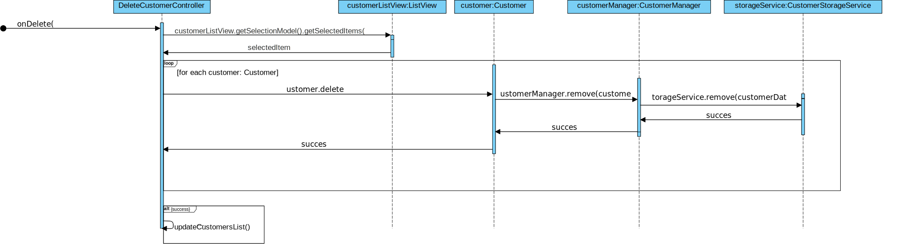

# Use Case Sequence diagrams

<!-- TOC -->
* [Use Case Sequence diagrams](#use-case-sequence-diagrams)
  * [Use case delete customer <Mathias\>](#use-case-delete-customer-mathias)
* [Back to Table of Contents](#back-to-table-of-contents)
<!-- TOC -->

## Use case delete customer <Mathias\>

---

# [Back to Table of Contents](../TableOfContents.md)
