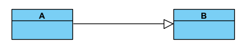

##  Vpp cheat sheet

### Relations

>   
>
>   1 **X** has at least one, maybe multiple **Y**. To be read from left to right
>
>   
>
>   **A** *inherits* **B** (everything from B is in A, but not the other way around)
>
>   
>
>   **C** *depends* on **D**
>
>   
>
>   **E** *implements* **F** ("E" is FImpl)
>
>   
>
>   Directed Association
>   Meaning somewhere in G theres a line ~ **H h = new H()**
>

---

## [Back to Table of Contents](../TableOfContents.md)