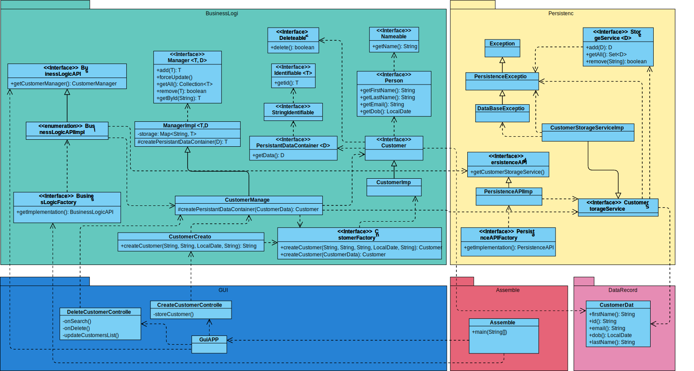

# Class Diagrams

<!-- TOC -->
* [Class Diagrams](#class-diagrams)
  * [Use case create/delete customer <Mathias\>](#use-case-createdelete-customer-mathias)
  * [Back to Table of Contents](#back-to-table-of-contents)
<!-- TOC -->

## Use case create/delete customer <Mathias\>

## [Back to Table of Contents](../TableOfContents.md)