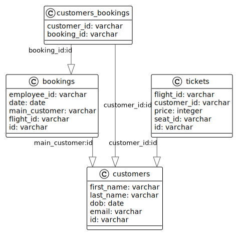

# Database

---

<!-- TOC -->
* [Database](#database)
  * [Database_tables](#databasetables)
    * [Table airplanes](#table-airplanes)
    * [Table airports](#table-airports)
    * [Table customers](#table-customers)
    * [Table routes](#table-routes)
    * [Table employees](#table-employees)
    * [Table flights](#table-flights)
    * [Table flights_for_route](#table-flightsforroute)
    * [Table customers_bookings](#table-customersbookings)
    * [Table tickets](#table-tickets)
  * [Use cases database schemas](#use-cases-database-schemas)
    * [Use case create/delete customer](#use-case-createdelete-customer)
<!-- TOC -->

## Database_tables

---

### Table airplanes

```sql
create table airplanes
(
  id           varchar not null 
      primary key,
  manufacturer varchar not null,
  length       integer not null,
  width        integer not null,
  model        varchar,
  seats        integer
);
```

---

### Table airports

```sql
create table airports
(
  id      varchar not null
    primary key,
  name    varchar not null,
  country varchar not null
);
```

---

### Table customers

```sql
create table customers
(
  id         varchar not null 
      primary key,
  first_name varchar not null,
  last_name  varchar not null,
  dob        date    not null,
  email      varchar
);
```                  

---

### Table routes

```sql
create table routes
(
  id    varchar not null 
      primary key,
  price integer,
  name  varchar
);
```

---
### Table employees

```sql
create table employees
(
  id         varchar not null
    primary key,
  first_name varchar not null,
  last_name  varchar not null,
  dob        date    not null,
  type_id    integer not null
);
```

---

### Table flights

```sql
create table flights
(
  id              varchar   not null 
      primary key,
  airport_from_id varchar   not null
    constraint flights_flights_from_fk
      references airports,
  airport_to_id   varchar   not null
    constraint flights_airports_to_fk
      references airports,
  etd             timestamp not null,
  eta             timestamp not null,
  flight_duration bigint    not null,
  airplane_id     varchar   not null
    constraint flights_airplanes__fk
      references airplanes
);
```

---

### Table flights_for_route

```sql
create table flights_for_route
(
    route_id        varchar not null
        constraint flights_for_route_routes_id_fk
            references routes,
    flight_id       varchar not null
        constraint flights_for_route_flights_id_fk
            references flights,
    transit_seconds bigint
);
```

---

### Table customers_bookings

```sql
create table customers_bookings
(
    customer_id varchar not null
        references customers,
    booking_id  varchar not null
        references bookings
);
```

---

### Table tickets

```sql
create table tickets
(
    id          varchar not null
        primary key,
    flight_id   varchar not null
        constraint fk_tickets_flight
            references flights,
    customer_id varchar not null,
    price       integer not null,
    seat_id     varchar not null
);
```

---

## Use cases database schemas

### Use case create/delete customer

